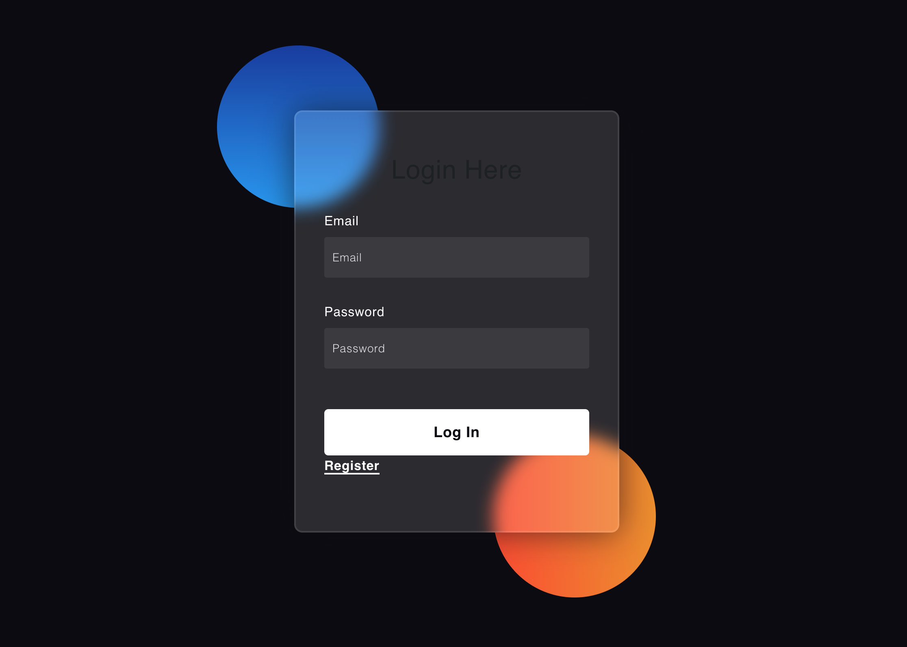
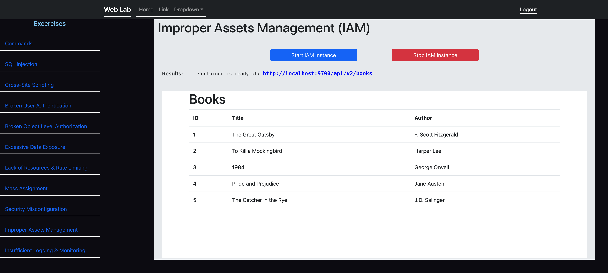

# web_lab

A full-stack web application that uses Docker, Node.js, Express, and React to demonstrate the [OWASP API Top Ten vulnerabilities](https://owasp.org/www-project-api-security/).

## Accomplishments

- [x] Injection (SQL Injection)
- [x] Cross-Site Scripting (XSS)
- [x] Broken User Authentication (Security Assertion Markup Language (SAML))
- [x] Broken Object Level Authorization
- [x] Excessive Data Exposure
- [x] Lack of Resources & Rate Limiting
- [ ] Broken Function Level Authorization
- [x] Mass Assignment
- [x] Security Misconfiguration
- [x] Improper Assets Management
- [ ] Insufficient Logging & Monitoring

# Preview

Here's a preview of what the projects looks like:

<div style="border: 1px solid #444; padding: 10px;">
  
  
</div>


## Table of Contents

- [web_lab](#web_lab)
  - [Table of Contents](#table-of-contents)
  - [About the Project](#about-the-project)
  - [Framework](#Framework)
  - [Getting Started](#getting-started)
    - [Prerequisites](#prerequisites)
    - [Installation](#installation)
  - [Usage](#usage)
  - [Roadmap](#roadmap)
  - [Contributing](#contributing)
  - [License](#license)
  - [Contact](#contact)
  - [Acknowledgements](#acknowledgements)

## About the Project
This project involves creating a web application that will serve as the main platform for users to practice exploiting web application vulnerabilities and learn about web application security. It will include a range of vulnerable web applications that users can test their skills on, including injection attacks, broken authentication and session management, and insufficient logging and monitoring. The website will be designed to be user-friendly and accessible to users of all skill levels. Specific features and functions, such as the types of vulnerabilities to be covered, will be further developed in the planning stage.

The web application will be used to demonstrate how these vulnerabilities can be exploited and how to prevent them. It will involve setting up a testing environment that simulates real-world scenarios. The lab will cover a range of vulnerabilities, including injection attacks, broken authentication and session management, and insufficient logging and monitoring. Overall, the project is an exciting opportunity to contribute to the field of web application security and make a positive impact in this area.

## Framework
This is a modern, scalable, and maintainable full-stack web applications. By using `Docker`, we can easily package and deploy your application across different environments, while `Node.js` and `Express` provide the server-side infrastructure for handling HTTP requests and serving dynamic content. Finally, `React` enables you to build rich and interactive user interfaces that can communicate with backend APIs.

## Getting Started

Include information about how to get started with the project. This include prerequisites and installation instructions.

### Prerequisites

Before you get started with this project, you'll need to have the following tools and technologies installed:

* `Docker` (v18 or higher)
* `Node.js` (v12 or higher)
* `NPM` (v6 or higher)
* `Express.js` (v4 or higher)
* `React.js` (v16 or higher)

You can download `Docker` from the official website: https://www.docker.com/products/docker-desktop

You can download `Node.js` and NPM from the official website: https://nodejs.org/en/download/

To install `Express.js` and `React.js`, open a terminal window and run the following command:

```
npm install -g express react
```
Once you have these tools installed, you're ready to move on to the next section and start setting up your development environment.

### Installation


## Usage

Provide examples and instructions on how to use the project. 
To run the Backend server outside of a Docker:
```
cd api
npm run start
```
To run the Frontend server outside of a Docker:
```
cd client
npm run start
```

## Roadmap

### Phase 1: Setup and Configuration
 1. Create project repository and README file
 2. Determine the necessary tools and dependencies for the development environment, such as the programming language, framework, and database, and install them
 3. Configure Docker setup for the web application
 4. Develop a main website for users to practice exploiting web application vulnerabilities 
 5. Integrate a Docker-in-Docker (dind) setup in the project
### Phase 2: Vulnerability Demonstrations
 1. Implement injection attack demonstrations (SQL injection, command injection, etc.)
 2. Implement broken authentication and session management demonstrations
 3. Implement cross-site scripting (XSS) and cross-site request forgery (CSRF) demonstrations
 4. Implement insufficient logging and monitoring demonstrations
### Phase 3: Penetration Testing and Vulnerability Exploration
 1. Conduct penetration testing to identify additional vulnerabilities and weaknesses in the web application
 2. Explore and experiment with different tools and techniques for identifying and exploiting vulnerabilities
### Phase 4: Fixing Vulnerabilities
 1. Analyze and prioritize vulnerabilities found in the testing phase
 2. Develop and implement fixes for identified vulnerabilities
 3. Conduct additional testing to ensure vulnerabilities are successfully fixed
### Phase 5: Documentation and Publication
 1. Create detailed documentation on the vulnerabilities demonstrated and how to prevent them
 2. Publish the project on a public platform (GitHub, etc.) for others to use and learn from
 3. Provide guidance and resources for users to continue learning and exploring web application security on their own.

## Contributing


## License

This project is licensed under the terms of the MIT License. See the [LICENSE](LICENSE) file for details.

This project uses the following open source components:

- [docker-test-saml-idp](https://github.com/kristophjunge/docker-test-saml-idp) under the MIT license by Kristoph Junge
- [simplesamlphp](https://github.com/simplesamlphp/simplesamlphp) UNDER GNU license by SimpleSAMLphp Community

## Contact

If you have any questions or suggestions about this project, please feel free to reach out to us at:

- Email: [peng.cai.perth@gmail.com](peng.cai.perth@gmail.com)
- GitHub: [redmojo7](https://github.com/redmojo7)
## Acknowledgements

We would like to express our sincere gratitude to the following individuals/organizations for their contributions to this project:

- [Open Web Application Security Project (OWASP)](https://owasp.org/) - provided resources and documentation on web application security best practices and common vulnerabilities
